# Durga Sahitya Bhandar — Phase 1 Architecture Document

**Version:** 1.0  
**Date:** 13 August 2026  
**Status:** Approved — Phase 3 in progress  
**Scope:** Architecture only — no application implementation

---

## Table of Contents

1. [Executive Summary](#1-executive-summary)
2. [System Architecture](#2-system-architecture)
3. [Frontend Architecture](#3-frontend-architecture)
4. [Backend Architecture](#4-backend-architecture)
5. [Database Schema](#5-database-schema)
6. [Entity Relationships](#6-entity-relationships)
7. [API Architecture](#7-api-architecture)
8. [Authentication Architecture](#8-authentication-architecture)
9. [RBAC Architecture](#9-rbac-architecture)
10. [Custom Roles](#10-custom-roles)
11. [Child-Admin Hierarchy](#11-child-admin-hierarchy)
12. [Access Scopes](#12-access-scopes)
13. [Permission Model](#13-permission-model)
14. [User Lifecycle](#14-user-lifecycle)
15. [Admin Sitemap](#15-admin-sitemap)
16. [Public Sitemap](#16-public-sitemap)
17. [CRM Architecture](#17-crm-architecture)
18. [Enquiry Lifecycle / State Machine](#18-enquiry-lifecycle--state-machine)
19. [Customer Deduplication](#19-customer-deduplication)
20. [WhatsApp Architecture](#20-whatsapp-architecture)
21. [Email Architecture](#21-email-architecture)
22. [Communication Architecture](#22-communication-architecture)
23. [Macro Architecture](#23-macro-architecture)
24. [Automation Engine](#24-automation-engine)
25. [SLA / Follow-Up Architecture](#25-sla--follow-up-architecture)
26. [Multilingual Architecture](#26-multilingual-architecture)
27. [International Phone Architecture](#27-international-phone-architecture)
28. [Book / Catalogue Architecture](#28-book--catalogue-architecture)
29. [CMS Architecture](#29-cms-architecture)
30. [Visibility Engine](#30-visibility-engine)
31. [Feature-Toggle Architecture](#31-feature-toggle-architecture)
32. [Media Architecture](#32-media-architecture)
33. [Public Tracking Security](#33-public-tracking-security)
34. [Audit Logging](#34-audit-logging)
35. [Security Architecture](#35-security-architecture)
36. [Testing Strategy](#36-testing-strategy)
37. [Deployment Architecture](#37-deployment-architecture)
38. [Development Roadmap](#38-development-roadmap)
39. [Open Questions & Decisions Required](#39-open-questions--decisions-required)

---

## 1. Executive Summary

Durga Sahitya Bhandar is a **B2B enquiry-driven platform** for a Hindu religious book publisher. It is **not e-commerce**. The core workflow is:

**Discover → Enquire → Identify Customer → Create Enquiry → Communicate → Follow Up → Quote/Order → Track → Complete**

The platform comprises two major systems:

| System | Purpose |
|--------|---------|
| **Public Website** | Multilingual catalogue, enquiry submission, WhatsApp contact, catalogue request, public tracking |
| **Admin Panel + CRM** | Configuration control plane, catalogue CMS, customer/enquiry management, communication, automation |

**Guiding principle:** The Admin Panel is the **control plane**. Normal business operations must not require developer intervention, source-code changes, or manual database edits.

**Tech stack (recommended):**

| Layer | Technology |
|-------|------------|
| Frontend | Next.js 15 (App Router) + TypeScript |
| UI | Tailwind CSS + Radix UI primitives + custom design system |
| Backend | Node.js + TypeScript (Express or Fastify) |
| API | REST (JSON) |
| Database | MongoDB Atlas |
| Auth | JWT (access + refresh) + httpOnly cookies |
| Storage | Cloud object storage (S3-compatible: AWS S3 / Cloudflare R2) |
| Email | Transactional provider (Resend / SendGrid / AWS SES) |
| WhatsApp | Official Meta WhatsApp Business API |
| Phone | libphonenumber-js |
| i18n | next-intl (frontend) + translation service (backend) |
| Jobs | BullMQ + Redis |
| Deployment | Vercel (frontend) + Railway/Fly.io/AWS (backend) + MongoDB Atlas |

---

## 2. System Architecture

### 2.1 High-Level Diagram

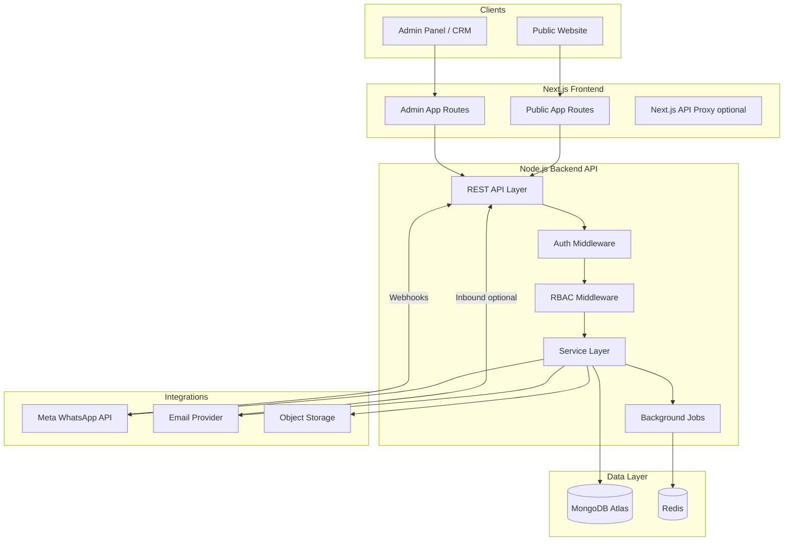

### 2.2 Repository Structure

```
Durgasahityabhandar/
├── frontend/                 # Next.js application
│   ├── app/
│   │   ├── (public)/         # Public website routes
│   │   ├── (admin)/          # Admin/CRM routes (auth-gated)
│   │   └── api/              # Optional BFF/proxy routes
│   ├── components/
│   │   ├── ui/               # Design system primitives
│   │   ├── public/
│   │   └── admin/
│   ├── hooks/
│   ├── lib/
│   ├── services/             # API client layer
│   └── messages/             # Static i18n fallbacks
├── backend/
│   ├── src/
│   │   ├── routes/
│   │   ├── controllers/      # Thin — delegate to services
│   │   ├── services/
│   │   ├── models/           # Mongoose schemas
│   │   ├── validators/       # Zod schemas
│   │   ├── middleware/
│   │   ├── integrations/
│   │   │   ├── whatsapp/
│   │   │   ├── email/
│   │   │   └── storage/
│   │   ├── jobs/
│   │   ├── utils/
│   │   └── config/
│   └── tests/
├── shared/                   # Shared TypeScript types & constants
│   ├── types/
│   ├── permissions/
│   └── validation/
├── docs/
├── .env.example
└── docker-compose.yml        # Local dev: MongoDB, Redis
```

### 2.3 Architectural Principles

1. **Admin-first configuration** — Business values live in the database, not code.
2. **Thin controllers, fat services** — Business logic in service layer.
3. **Backend is authority** — RBAC enforced server-side; UI is convenience only.
4. **Integration isolation** — WhatsApp, email, storage behind adapter interfaces.
5. **Multilingual from day one** — No English-only shortcuts.
6. **Incremental delivery** — Phase-by-phase with tests at each gate.
7. **No fake production** — Mock adapters clearly labelled for dev.

### 2.4 Deployment Topology (Production)

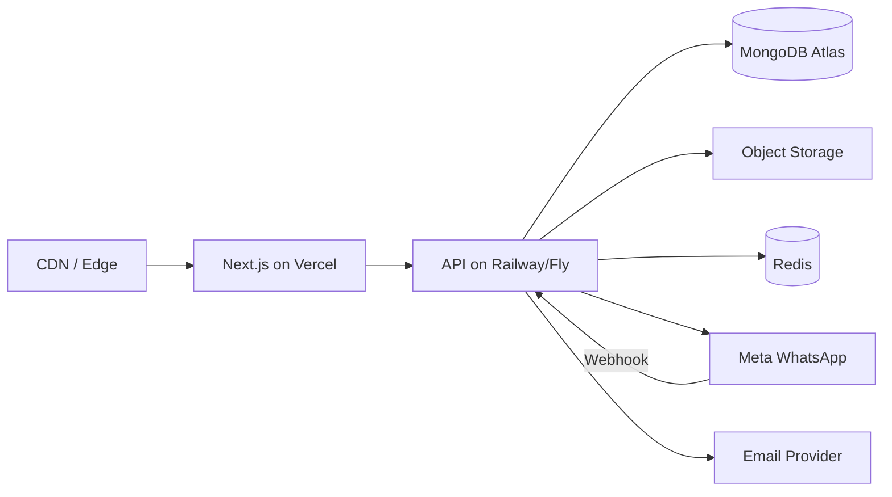

---

## 3. Frontend Architecture

### 3.1 Application Split

Single Next.js monorepo app with route groups:

| Route Group | URL Prefix | Auth | Purpose |
|-------------|------------|------|---------|
| `(public)` | `/`, `/books`, `/enquiry`, etc. | None | Customer-facing website |
| `(admin)` | `/admin/*` | Required | CRM + configuration |
| `(auth)` | `/login`, `/invite/*` | Partial | Authentication flows |

### 3.2 Rendering Strategy

| Area | Strategy | Rationale |
|------|----------|-----------|
| Public catalogue pages | SSG + ISR (revalidate on publish) | SEO, performance |
| Public book detail | SSG + ISR | SEO |
| Public enquiry forms | Client + Server Actions or API | Interactivity |
| Admin CRM | CSR + SSR shell | Real-time, authenticated |
| Admin settings | CSR | Complex forms |

### 3.3 State Management

| Concern | Approach |
|---------|----------|
| Server data | TanStack Query (React Query) |
| Auth session | Context + httpOnly cookie |
| UI state | React useState / useReducer |
| Form state | React Hook Form + Zod |
| Language | next-intl + URL prefix `/en/`, `/hi/`, etc. |

### 3.4 Design System

Build a small internal component library on Radix UI + Tailwind:

- Button, Input, Select, Textarea, Dialog, Sheet, Dropdown, Tabs
- DataTable (admin), FilterBar, StatusBadge, Timeline, EmptyState
- PhoneInput (international), LanguageSwitcher
- Toast notifications (sonner)

**Public aesthetic:** Premium, spacious, trustworthy — warm neutrals, subtle accent (saffron/deep gold as accent only), serif headings optional for Sanskrit/Hindi content.

**Admin aesthetic:** Linear/Zendesk-inspired — dense but clear, sidebar navigation, command palette (future), keyboard-friendly.

### 3.5 API Client Layer

```typescript
// frontend/services/api-client.ts
// Centralized fetch wrapper with:
// - Base URL from env
// - Auth cookie forwarding
// - Error normalization
// - Request ID header
// - Typed responses from shared/types
```

### 3.6 Permission-Aware UI

Navigation and action buttons computed from:

```typescript
interface UserPermissions {
  modules: Record<ModuleKey, boolean>;
  actions: Record<`${ModuleKey}.${ActionKey}`, boolean>;
  scope: AccessScope;
}
```

Fetched on login; refreshed on role change. **Never relied upon for security** — backend rejects unauthorized calls.

---

## 4. Backend Architecture

### 4.1 Layered Architecture

```
Request
  → Rate Limiter
  → Request ID / Logging
  → Authentication (JWT)
  → Authorization (RBAC + Scope)
  → Validation (Zod)
  → Controller (thin)
  → Service (business logic)
  → Model / Repository
  → Response
```

### 4.2 Service Domains

| Service | Responsibility |
|---------|----------------|
| `AuthService` | Login, refresh, invite, password reset |
| `UserService` | User CRUD, lifecycle |
| `RoleService` | Roles, permissions, hierarchy enforcement |
| `CustomerService` | CRUD, deduplication, merge |
| `EnquiryService` | CRUD, assignment, timeline |
| `BookService` | Catalogue CRUD, publish workflow |
| `CmsService` | Pages, sections, homepage |
| `MediaService` | Upload, library, usage tracking |
| `CommunicationService` | Email + WhatsApp orchestration |
| `MacroService` | Macro execution |
| `AutomationService` | Rule evaluation engine |
| `TranslationService` | i18n resolution with fallback |
| `VisibilityService` | Centralized visibility checks |
| `FeatureToggleService` | Feature flags |
| `PhoneService` | Normalize, validate E.164 |
| `TrackingService` | Public enquiry tracking |
| `AuditService` | Audit log writes |
| `ReportService` | Analytics queries |

### 4.3 Background Jobs (BullMQ)

| Job | Trigger |
|-----|---------|
| `send-email` | Communication events |
| `send-whatsapp` | Communication events |
| `process-whatsapp-webhook` | Incoming webhook |
| `run-automation` | Enquiry events |
| `sla-check` | Scheduled cron |
| `follow-up-reminder` | Scheduled cron |
| `generate-thumbnail` | Media upload |
| `retry-failed-communication` | Manual / scheduled |

### 4.4 Error Handling

Standard error response:

```json
{
  "error": {
    "code": "ENQUIRY_NOT_FOUND",
    "message": "Enquiry not found",
    "details": {},
    "requestId": "req_abc123"
  }
}
```

HTTP status mapping: 400 validation, 401 unauthenticated, 403 unauthorized, 404 not found, 409 conflict, 429 rate limit, 500 internal.

---

## 5. Database Schema

**Database:** MongoDB Atlas  
**ODM:** Mongoose with schema validation  
**Naming:** camelCase fields, PascalCase collection names optional (prefer lowercase plural: `users`, `enquiries`)

### 5.1 Core Identity & Access

#### `users`

| Field | Type | Notes |
|-------|------|-------|
| `_id` | ObjectId | |
| `email` | String | Unique, indexed, lowercase |
| `passwordHash` | String | bcrypt |
| `name` | String | |
| `phone` | String | E.164, optional |
| `profilePhotoMediaId` | ObjectId | ref media |
| `status` | Enum | invited, active, suspended, archived |
| `roleIds` | [ObjectId] | ref roles |
| `teamIds` | [ObjectId] | ref teams |
| `department` | String | optional |
| `accessScope` | Enum | own, assigned, team, department, all |
| `preferredLanguage` | String | ISO code |
| `timezone` | String | IANA |
| `notificationPreferences` | Object | |
| `createdBy` | ObjectId | ref users |
| `lastLoginAt` | Date | |
| `inviteToken` | String | hashed, optional |
| `inviteExpiresAt` | Date | |
| `createdAt`, `updatedAt` | Date | |

**Indexes:** `email` (unique), `status`, `teamIds`

#### `roles`

| Field | Type | Notes |
|-------|------|-------|
| `_id` | ObjectId | |
| `name` | String | Unique slug + display name |
| `slug` | String | e.g. `crm-agent` |
| `description` | String | |
| `isSystem` | Boolean | Default roles cannot be deleted |
| `isActive` | Boolean | |
| `permissionIds` | [ObjectId] | ref permissions |
| `moduleAccess` | [String] | Module keys for nav |
| `createdBy` | ObjectId | |
| `createdAt`, `updatedAt` | Date | |

#### `permissions`

| Field | Type | Notes |
|-------|------|-------|
| `_id` | ObjectId | |
| `module` | String | e.g. `books`, `enquiries` |
| `action` | String | e.g. `view`, `create`, `edit` |
| `key` | String | Unique: `books.view` |
| `description` | String | |

**Seed permissions** for all modules × actions defined in spec §67.

#### `teams`

| Field | Type | Notes |
|-------|------|-------|
| `_id` | ObjectId | |
| `name` | String | |
| `slug` | String | |
| `description` | String | |
| `isActive` | Boolean | |
| `memberIds` | [ObjectId] | denormalized for query speed |
| `createdAt`, `updatedAt` | Date | |

#### `auditLogs`

| Field | Type | Notes |
|-------|------|-------|
| `_id` | ObjectId | |
| `actorId` | ObjectId | ref users |
| `action` | String | e.g. `user.created` |
| `targetType` | String | e.g. `User`, `Enquiry` |
| `targetId` | ObjectId | |
| `previousValue` | Mixed | |
| `newValue` | Mixed | |
| `metadata` | Object | IP, user agent |
| `createdAt` | Date | TTL optional for old logs |

**Indexes:** `actorId`, `targetType + targetId`, `createdAt`

---

### 5.2 Customers & Enquiries

#### `customers`

| Field | Type | Notes |
|-------|------|-------|
| `_id` | ObjectId | |
| `customerNumber` | String | `CUST-00042`, unique |
| `businessName` | String | |
| `contactName` | String | |
| `phone` | String | E.164, indexed |
| `phoneNormalized` | String | digits only for matching |
| `whatsapp` | String | E.164 |
| `email` | String | lowercase, indexed |
| `country` | String | ISO 3166-1 alpha-2 |
| `preferredLanguage` | String | ISO code |
| `location` | Object | city, state, address |
| `tags` | [String] | |
| `stats` | Object | totalEnquiries, openEnquiries, etc. |
| `mergedIntoId` | ObjectId | if merged |
| `isArchived` | Boolean | |
| `createdAt`, `updatedAt` | Date | |

**Indexes:** `phoneNormalized` (unique sparse), `email` (sparse), `customerNumber` (unique), `businessName` (text)

#### `enquiries`

| Field | Type | Notes |
|-------|------|-------|
| `_id` | ObjectId | |
| `enquiryNumber` | String | `ENQ-2026-0042`, unique |
| `customerId` | ObjectId | ref customers |
| `source` | Enum | website, whatsapp, email, manual |
| `statusId` | ObjectId | ref statuses |
| `priorityId` | ObjectId | ref priorities |
| `assignedUserId` | ObjectId | nullable |
| `assignedTeamId` | ObjectId | nullable |
| `subject` | String | |
| `message` | String | initial message |
| `requestedBooks` | [Object] | bookId, title, quantity |
| `country` | String | |
| `preferredLanguage` | String | copied from customer |
| `tags` | [String] | |
| `category` | String | WhatsApp classification |
| `sla` | Object | firstResponseDue, breached, etc. |
| `isArchived` | Boolean | |
| `closedAt` | Date | |
| `createdAt`, `updatedAt` | Date | |

**Indexes:** `enquiryNumber` (unique), `customerId`, `statusId`, `assignedUserId`, `assignedTeamId`, `source`, `createdAt`, compound for inbox filters

#### `enquiryMessages`

| Field | Type | Notes |
|-------|------|-------|
| `_id` | ObjectId | |
| `enquiryId` | ObjectId | |
| `type` | Enum | customer, agent, internal_note, system, automation |
| `channel` | Enum | website, whatsapp, email, crm |
| `content` | String | |
| `authorId` | ObjectId | user or null for customer |
| `authorName` | String | denormalized |
| `attachmentIds` | [ObjectId] | |
| `metadata` | Object | WhatsApp message ID, email ID |
| `createdAt` | Date | |

**Indexes:** `enquiryId + createdAt`

#### `enquiryEvents`

| Field | Type | Notes |
|-------|------|-------|
| `_id` | ObjectId | |
| `enquiryId` | ObjectId | |
| `eventType` | String | status_changed, assigned, etc. |
| `actorId` | ObjectId | |
| `data` | Object | previous/new values |
| `createdAt` | Date | |

#### `enquiryAttachments`

| Field | Type | Notes |
|-------|------|-------|
| `_id` | ObjectId | |
| `enquiryId` | ObjectId | |
| `mediaId` | ObjectId | |
| `uploadedBy` | ObjectId | |
| `type` | Enum | catalogue, quotation, invoice, other |
| `createdAt` | Date | |

---

### 5.3 Catalogue

#### `books`

| Field | Type | Notes |
|-------|------|-------|
| `_id` | ObjectId | |
| `slug` | String | unique per language handled via translation |
| `sku` | String | optional internal code |
| `categoryIds` | [ObjectId] | |
| `subjectIds` | [ObjectId] | |
| `tagIds` | [ObjectId] | |
| `languageId` | ObjectId | book content language |
| `availabilityId` | ObjectId | admin-managed |
| `physical` | Object | pages, pageTypeId, gsm, weightGrams, lengthMm, widthMm, heightMm, bindingTypeId |
| `publishing` | Object | isbn, edition, publicationYear, publisher |
| `commercial` | Object | mrp, wholesalePrice, moq, currency |
| `fieldVisibility` | Object | per-field show/hide on public |
| `priceVisibility` | Object | showMrp, showWholesale, showMoq |
| `coverMediaId` | ObjectId | |
| `galleryMediaIds` | [ObjectId] | ordered |
| `isFeatured` | Boolean | |
| `publishStatus` | Enum | draft, preview, published, archived |
| `publishedAt` | Date | |
| `createdBy` | ObjectId | |
| `createdAt`, `updatedAt` | Date | |

#### `bookTranslations`

| Field | Type | Notes |
|-------|------|-------|
| `_id` | ObjectId | |
| `bookId` | ObjectId | |
| `languageCode` | String | en, hi, sa, ne |
| `title` | String | |
| `slug` | String | unique compound index bookId+languageCode |
| `author` | String | |
| `translator` | String | |
| `commentator` | String | |
| `shortDescription` | String | |
| `detailedDescription` | String | |
| `contentHighlights` | [String] | |
| `seo` | Object | title, description, etc. |

**Indexes:** `bookId + languageCode` (unique), text index on title, author

#### `categories` (hierarchical — see §28.6)

| Field | Type | Notes |
|-------|------|-------|
| `_id` | ObjectId | |
| `parentId` | ObjectId | nullable — root categories |
| `ancestorIds` | [ObjectId] | denormalized path for queries |
| `slug` | String | unique, admin-configured |
| `status` | Enum | draft, published, hidden, archived |
| `isVisible` | Boolean | independent visibility toggle |
| `isFeatured` | Boolean | homepage/nav highlights |
| `displayOrder` | Number | sibling sort order |
| `imageMediaId` | ObjectId | optional category image |
| `iconMediaId` | ObjectId | optional icon |
| `translations` | [{ languageCode, name, shortDescription, description }] | multilingual |
| `seo` | Object | title, description, keywords, social, canonical, indexable |
| `archivedAt` | Date | soft archive timestamp |
| `createdBy` | ObjectId | |
| `createdAt`, `updatedAt` | Date | |

**Indexes:** `slug` (unique), `parentId`, `status`, `isVisible`, `displayOrder`, `ancestorIds`

#### `pageTypes`, `bindingTypes`, `subjects`, `tags`, `availabilityStatuses`

Admin-managed lookup collections with common shape:

| Field | Type |
|-------|------|
| `_id` | ObjectId |
| `slug` | String (unique) |
| `sortOrder` | Number |
| `isActive` | Boolean |
| `isArchived` | Boolean |
| `translations` | [{ languageCode, name, description }] |
| `createdAt`, `updatedAt` | Date |

---

### 5.4 CMS

#### `pages`

| Field | Type | Notes |
|-------|------|-------|
| `_id` | ObjectId | |
| `slug` | String | unique |
| `type` | Enum | home, about, wholesale, contact, custom, etc. |
| `publishStatus` | Enum | draft, preview, published |
| `isVisible` | Boolean | |
| `sortOrder` | Number | nav order |
| `translations` | [{ languageCode, title, content, seo }] |
| `createdAt`, `updatedAt` | Date | |

#### `sections` (Homepage builder)

| Field | Type | Notes |
|-------|------|-------|
| `_id` | ObjectId | |
| `pageId` | ObjectId | typically homepage |
| `type` | Enum | hero, banner, featured_books, categories, etc. |
| `sortOrder` | Number | |
| `publishStatus` | Enum | draft, preview, published |
| `isVisible` | Boolean | |
| `config` | Object | type-specific JSON (book IDs, CTA links, etc.) |
| `translations` | [{ languageCode, heading, subheading, body, ctaText }] |
| `createdAt`, `updatedAt` | Date | |

#### `menus`

Navigation structure — configurable items linking to pages, external URLs, or feature routes.

---

### 5.5 Communication & Automation

#### `emailTemplates` / `whatsappTemplates`

| Field | Type | Notes |
|-------|------|-------|
| `_id` | ObjectId | |
| `name` | String | |
| `eventKey` | String | enquiry_created, quotation_sent, etc. |
| `languageCode` | String | |
| `subject` | String | email only |
| `body` | String | supports {{variables}} |
| `whatsappTemplateName` | String | Meta-approved name |
| `whatsappTemplateLanguage` | String | |
| `isActive` | Boolean | |
| `createdAt`, `updatedAt` | Date | |

#### `communicationLogs`

| Field | Type | Notes |
|-------|------|-------|
| `_id` | ObjectId | |
| `enquiryId` | ObjectId | |
| `customerId` | ObjectId | |
| `channel` | Enum | email, whatsapp |
| `direction` | Enum | inbound, outbound |
| `eventKey` | String | |
| `templateId` | ObjectId | |
| `recipient` | String | |
| `status` | Enum | pending, sent, delivered, failed, read |
| `errorMessage` | String | |
| `externalId` | String | provider message ID |
| `retryCount` | Number | |
| `createdAt`, `updatedAt` | Date | |

#### `macros`

| Field | Type | Notes |
|-------|------|-------|
| `_id` | ObjectId | |
| `name` | String | |
| `description` | String | |
| `isActive` | Boolean | |
| `actions` | [Object] | ordered action definitions |
| `createdBy` | ObjectId | |
| `createdAt`, `updatedAt` | Date | |

#### `automationRules`

| Field | Type | Notes |
|-------|------|-------|
| `_id` | ObjectId | |
| `name` | String | |
| `trigger` | Object | type + config |
| `conditions` | [Object] | AND/OR groups |
| `actions` | [Object] | same schema as macro actions |
| `isActive` | Boolean | |
| `sortOrder` | Number | |
| `createdAt`, `updatedAt` | Date | |

#### `statuses`, `priorities`

Admin-managed CRM configuration:

| statuses extra fields | |
|-----------------------|---|
| `isPublic` | Show on public tracking timeline |
| `publicLabel` | Translations for customer-facing label |
| `color` | UI badge color |
| `sortOrder` | Workflow order |
| `isTerminal` | Closed/completed states |

---

### 5.6 System Configuration

#### `languages`

| Field | Type |
|-------|------|
| `code` | String (unique): en, hi, sa, ne |
| `name` | String |
| `nativeName` | String |
| `direction` | ltr / rtl |
| `isEnabled` | Boolean |
| `isDefault` | Boolean |
| `isFallback` | Boolean |
| `sortOrder` | Number |

#### `translations` (UI strings)

| Field | Type |
|-------|------|
| `key` | String |
| `languageCode` | String |
| `value` | String |
| `namespace` | String (nav, forms, crm, etc.) |

**Index:** `key + languageCode + namespace` (unique)

#### `systemSettings`

Key-value document(s) or single document with nested keys:

```javascript
{
  publisher: { name, logoMediaId, phone, email, whatsapp, address },
  defaults: { enquiryStatusId, priorityId, language, timezone, currency },
  sla: { firstResponseHours, followUpHours, escalationHours },
  tracking: { verificationMethod: 'phone_last4' | 'email' | 'otp_future' },
  communication: { emailEnabled, whatsappEnabled, fallbackLanguage },
  publicTracking: { enabledStatusIds: [...] }
}
```

#### `featureToggles`

| Field | Type |
|-------|------|
| `key` | String (unique) |
| `name` | String |
| `description` | String |
| `isEnabled` | Boolean |
| `updatedBy` | ObjectId |
| `updatedAt` | Date |

**Seed toggles:** book_catalogue, enquiries, whatsapp, email, catalogue_download, pricing, public_tracking, maintenance_mode

#### `media`

| Field | Type |
|-------|------|
| `_id` | ObjectId |
| `filename` | String |
| `originalName` | String |
| `mimeType` | String |
| `sizeBytes` | Number |
| `storageKey` | String |
| `url` | String |
| `thumbnailUrl` | String |
| `altText` | String |
| `uploadedBy` | ObjectId |
| `isArchived` | Boolean |
| `usageCount` | Number |
| `createdAt` | Date |

---

## 6. Entity Relationships

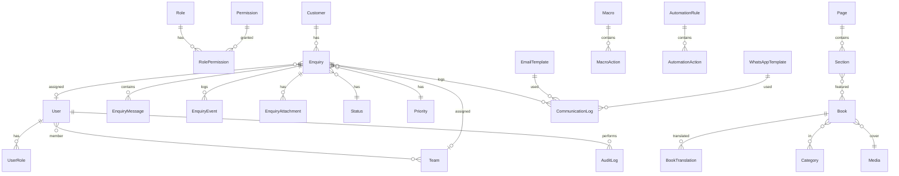

### Key Cardinality Rules

- **Customer 1 → N Enquiries** — Never 1:1 forced
- **Enquiry 1 → N Messages** — Timeline is append-only
- **Book 1 → N Translations** — One per enabled language
- **User N → N Roles** — Via roleIds array (simplified) or junction collection if needed
- **Merged customers** — `mergedIntoId` points to survivor; enquiries re-linked on merge

---

## 7. API Architecture

### 7.1 Conventions

| Aspect | Standard |
|--------|----------|
| Base path | `/api/v1` |
| Auth | Bearer JWT in Authorization header OR httpOnly cookie |
| Pagination | `?page=1&limit=20` → `{ data, meta: { page, limit, total, totalPages } }` |
| Sorting | `?sort=-createdAt` |
| Filtering | Query params per resource |
| IDs | MongoDB ObjectId in URLs |
| Public slugs | `/api/v1/public/books/:slug?lang=hi` |

### 7.2 API Domains

#### Auth — `/api/v1/auth`

| Method | Path | Auth | Description |
|--------|------|------|-------------|
| POST | `/login` | No | Login |
| POST | `/logout` | Yes | Logout |
| POST | `/refresh` | Refresh token | Rotate tokens |
| POST | `/invite/accept` | Token | Accept invite |
| POST | `/forgot-password` | No | Request reset |
| POST | `/reset-password` | Token | Reset password |
| GET | `/me` | Yes | Current user + permissions |

#### Users — `/api/v1/users`

CRUD with RBAC. Scope-filtered list for non-admin roles.

#### Roles & Permissions — `/api/v1/roles`, `/api/v1/permissions`

Custom role builder endpoints. Permission grant validates escalation boundary.

#### Teams — `/api/v1/teams`

#### Customers — `/api/v1/customers`

| Method | Path | Notes |
|--------|------|-------|
| GET | `/` | Search, filter, scope |
| POST | `/` | Create |
| GET | `/:id` | Detail + enquiry summary |
| PATCH | `/:id` | Update |
| POST | `/:id/merge` | Merge duplicate |
| GET | `/match` | Deduplication lookup |

#### Enquiries — `/api/v1/enquiries`

| Method | Path | Notes |
|--------|------|-------|
| GET | `/` | Inbox with filters |
| POST | `/` | Create (manual) |
| GET | `/:id` | Full detail + timeline |
| PATCH | `/:id` | Update fields |
| POST | `/:id/messages` | Reply / note |
| POST | `/:id/assign` | Assign user/team |
| POST | `/:id/status` | Change status |
| POST | `/:id/attachments` | Upload |
| POST | `/:id/macros/:macroId` | Execute macro |

#### Public — `/api/v1/public`

| Method | Path | Notes |
|--------|------|-------|
| GET | `/books` | Published catalogue |
| GET | `/books/:slug` | Book detail |
| GET | `/categories` | Category tree |
| GET | `/pages/:slug` | CMS page |
| GET | `/homepage` | Composed sections |
| POST | `/enquiries` | Submit enquiry |
| POST | `/catalogue-request` | Request catalogue |
| POST | `/track/verify` | Verify tracking access |
| GET | `/track/:token` | Public timeline (after verify) |
| GET | `/settings` | Public site config (contact, toggles) |
| GET | `/languages` | Enabled languages |

#### Webhooks — `/api/v1/webhooks`

| Method | Path | Notes |
|--------|------|-------|
| GET | `/whatsapp` | Meta verification |
| POST | `/whatsapp` | Incoming messages |
| POST | `/email/inbound` | Optional inbound email |

All other domains per spec §84: books, categories, media, pages, sections, macros, automations, templates, languages, translations, reports, settings, features.

### 7.3 Versioning

URL prefix `/api/v1`. Breaking changes → `/api/v2`. Non-breaking additions allowed in v1.

---

## 8. Authentication Architecture

### 8.1 Strategy

**JWT dual-token pattern:**

| Token | Lifetime | Storage |
|-------|----------|---------|
| Access token | 15 minutes | Memory or short-lived cookie |
| Refresh token | 7 days | httpOnly, Secure, SameSite=Strict cookie |

### 8.2 Password Security

- bcrypt with cost factor 12
- Minimum 10 characters, complexity rules configurable
- Rate limit login: 5 attempts / 15 min per IP + email

### 8.3 Invite Flow

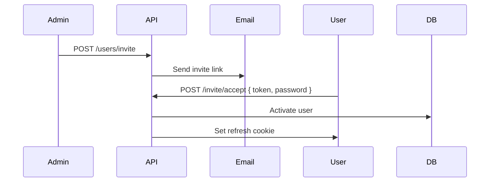

### 8.4 Session Invalidation

- Password change → invalidate all refresh tokens
- User suspended → reject all tokens immediately
- Role/permission change → access token expires naturally; optional force logout

### 8.5 Public Endpoints

No auth required. Rate limited. CAPTCHA on enquiry submission (future/configurable).

### 8.6 Tracking Token

Separate short-lived JWT for public tracking after verification — scoped to single enquiry, read-only.

---

## 9. RBAC Architecture

### 9.1 Three-Level Enforcement

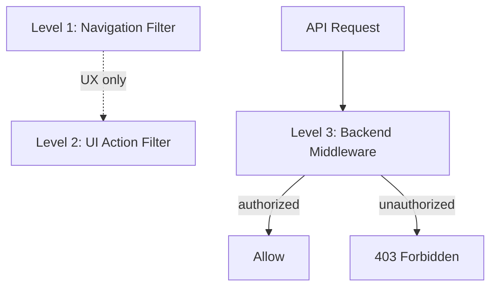

### 9.2 Permission Check Algorithm

```typescript
function can(user: User, permission: string, resource?: Resource): boolean {
  // 1. Super admin bypass (optional explicit flag on role)
  // 2. Collect permissions from all active roles
  // 3. Check module access gate
  // 4. Check action permission
  // 5. Apply access scope to resource query
}
```

### 9.3 Default System Roles (Seed Data)

| Role | Module Access | Notes |
|------|---------------|-------|
| Super Admin | All | Cannot be deleted |
| Administrator | All except system-critical | Configurable |
| Catalogue Admin | Catalogue, Media, Website (partial) | Child admin template |
| CRM Manager | CRM, Communication, Reports | |
| CRM Agent | CRM (assigned scope) | |
| Support Agent | Communication, Enquiries (reply) | |
| Viewer | Read-only modules | |

Custom roles can be created with any permission subset.

---

## 10. Custom Roles

### 10.1 Role Builder UI

Admin → Users → Roles → Create Role:

1. Name + description
2. Module access toggles
3. Per-module action matrix (view/create/edit/delete/...)
4. Default access scope
5. Save → creates `roles` document with `permissionIds`

### 10.2 System vs Custom

| Type | Editable | Deletable |
|------|----------|-----------|
| System (`isSystem: true`) | Permissions yes, slug no | No |
| Custom | Yes | Yes (if no users assigned) |

---

## 11. Child-Admin Hierarchy

### 11.1 Model

Each user has `createdBy` pointing to the admin who created them. Permission grants are bounded:

**Rule:** User U cannot assign permission P to user V unless U possesses P.

```typescript
function validatePermissionGrant(
  granter: User,
  targetPermissions: Permission[]
): void {
  const granterPerms = resolvePermissions(granter);
  for (const p of targetPermissions) {
    if (!granterPerms.has(p.key)) {
      throw new ForbiddenError('PERMISSION_ESCALATION');
    }
  }
}
```

### 11.2 Hierarchy Diagram

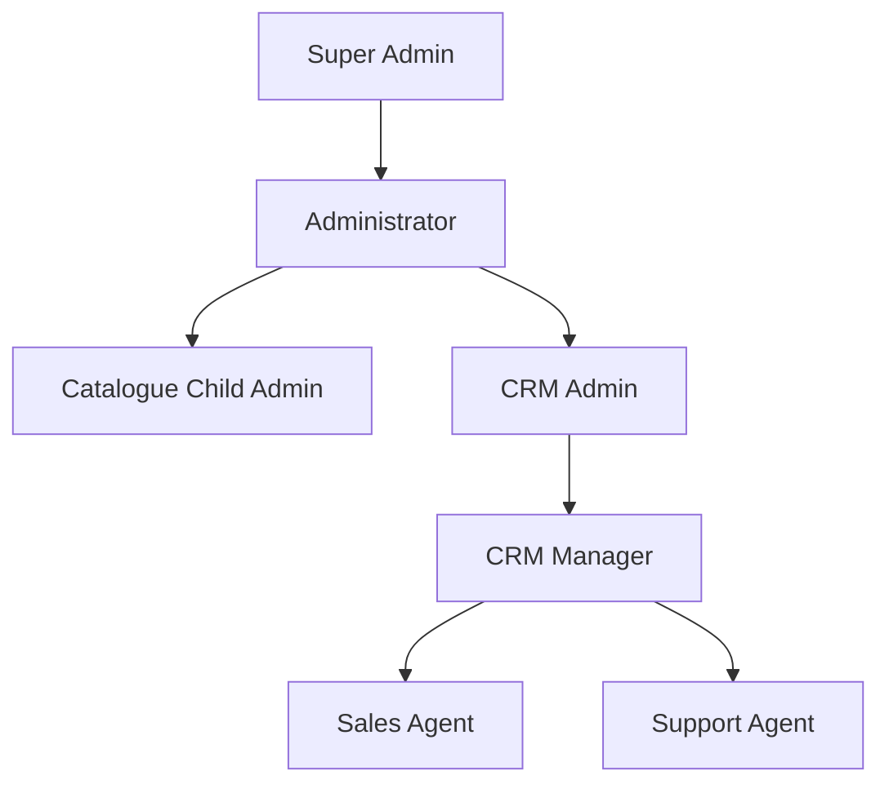

### 11.3 User Management Scope

Admin can only manage users they created OR users with roles strictly below their authority level. Super Admin manages all.

---

## 12. Access Scopes

### 12.1 Scope Levels

| Scope | Enquiry Access | Customer Access |
|-------|----------------|-----------------|
| `own` | Created by user | Linked to own enquiries |
| `assigned` | Assigned to user | Customers of assigned enquiries |
| `team` | Assigned to user's team(s) | Customers of team enquiries |
| `department` | User's department | Related customers |
| `all` | All enquiries | All customers |

### 12.2 Query Middleware

All list/detail queries inject scope filter:

```typescript
function applyEnquiryScope(user: User, query: FilterQuery) {
  switch (user.accessScope) {
    case 'assigned': return { ...query, assignedUserId: user._id };
    case 'team': return { ...query, assignedTeamId: { $in: user.teamIds } };
    case 'all': return query;
    // ...
  }
}
```

Scope is **additive** to permissions — user needs `enquiries.view` AND appropriate scope.

---

## 13. Permission Model

### 13.1 Module + Action Matrix

Full seed list (abbreviated — complete list in `shared/permissions/index.ts`):

| Module | Actions |
|--------|---------|
| books | view, create, edit, archive, delete, publish, change_visibility |
| categories | view, create, edit, reorder, publish, hide, archive, delete |
| media | view, upload, edit, archive, delete |
| customers | view, create, edit, merge, archive, delete |
| enquiries | view, create, edit, assign, reassign, reply, internal_note, change_status, change_priority, close, reopen, delete |
| communication | view, send_email, send_whatsapp, retry, manage_templates |
| macros | view, create, edit, delete, execute |
| automations | view, create, edit, enable_disable, delete |
| website | view, edit, publish, unpublish |
| users | view, create, edit, disable, delete |
| roles | view, create, edit, delete, assign_permissions |
| reports | view, export |
| settings | view, edit |

### 13.2 Permission Key Format

`{module}.{action}` — e.g. `enquiries.change_status`

---

## 14. User Lifecycle

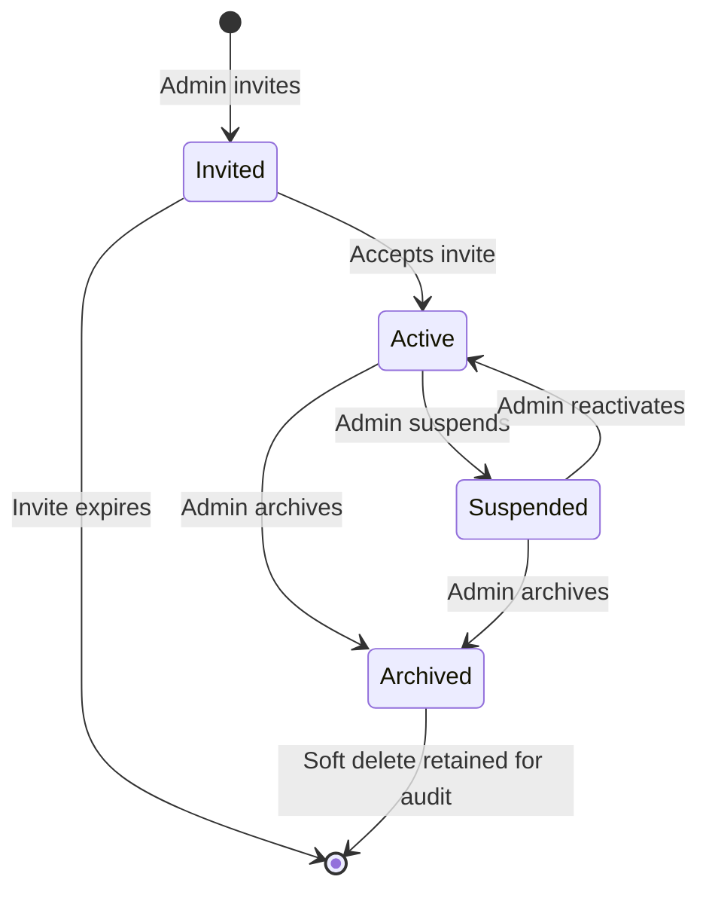

| Status | Can Login | Appears in Lists | Historical Data |
|--------|-----------|------------------|-----------------|
| Invited | No | Yes | N/A |
| Active | Yes | Yes | Yes |
| Suspended | No | Yes | Preserved |
| Archived | No | Hidden (filter) | Preserved |

Reassignment job triggered when user archived: open enquiries → unassigned or team queue.

---

## 15. Admin Sitemap

```
/admin
├── Dashboard
├── CRM
│   ├── Inbox (Enquiries)
│   ├── Enquiry Detail /:id
│   ├── Customers
│   │   └── Customer Detail /:id
│   ├── Follow-ups
│   └── SLA Overview
├── Catalogue
│   ├── Books
│   │   ├── List
│   │   ├── Create / Edit
│   │   └── Import (future)
│   ├── Categories
│   ├── Lookups
│   │   ├── Page Types
│   │   ├── Binding Types
│   │   ├── Subjects
│   │   ├── Tags
│   │   └── Availability
│   └── Media Library
├── Website
│   ├── Pages
│   ├── Homepage Builder
│   ├── Navigation / Menus
│   └── SEO Settings
├── Communication
│   ├── Templates
│   │   ├── Email
│   │   └── WhatsApp
│   ├── Communication Log
│   └── WhatsApp Settings
├── Automation
│   ├── Macros
│   ├── Automations
│   └── SLA Configuration
├── Reports
│   ├── Enquiry Reports
│   ├── Book Demand
│   ├── Agent Performance
│   └── Export
├── Users & Access
│   ├── Users
│   ├── Teams
│   ├── Roles & Permissions
│   └── Audit Log
└── Settings
    ├── General (Publisher info)
    ├── Languages & Translations
    ├── Feature Toggles
    ├── Enquiry Statuses & Priorities
    ├── Integrations
    ├── Maintenance
    └── Security
```

---

## 16. Public Sitemap

```
/                           Home (configurable sections)
/{lang}/                    Language-prefixed routes
/{lang}/about               About Publisher
/{lang}/books               Book catalogue
/{lang}/books/:slug         Book detail
/{lang}/categories          Category listing
/{lang}/categories/:slug    Category books
/{lang}/wholesale             B2B / Wholesale info
/{lang}/catalogue             Request catalogue
/{lang}/enquiry               General enquiry form
/{lang}/enquiry/book/:slug    Book-specific enquiry
/{lang}/contact               Contact page
/{lang}/track                 Track enquiry (verify)
/{lang}/track/:reference      Tracking timeline (post-verify)
```

All pages admin-controllable for visibility, content, SEO, publish status.

---

## 17. CRM Architecture

### 17.1 Unified Inbox

Single enquiry list with filters:

| Filter | Type |
|--------|------|
| Source | website, whatsapp, email, manual |
| Status | multi-select |
| Priority | multi-select |
| Agent | user select |
| Team | team select |
| Country | select |
| Language | select |
| Date range | date picker |
| Book | search |
| Search | enquiry #, customer, phone, email |

### 17.2 Enquiry Detail Layout

```
┌─────────────────────────────────────────────────────────┐
│ Header: ENQ-2026-0042 │ Status │ Priority │ Assign │ ⋮  │
├──────────────────────────────┬──────────────────────────┤
│ Conversation Timeline        │ Customer Sidebar         │
│ ┌──────────────────────────┐ │ Business: ABC Book Store │
│ │ Customer message         │ │ Phone: +919876543210     │
│ │ Agent reply              │ │ Email: ...               │
│ │ Internal note (private)  │ │ Country: India           │
│ │ System: Status changed   │ │ Language: Hindi          │
│ │ Automation: Email sent   │ │ ─────────────────────    │
│ └──────────────────────────┘ │ Enquiry History          │
│ Reply box + Attach + Macro   │ Requested Books          │
│                              │ SLA Indicator            │
│                              │ Follow-ups               │
└──────────────────────────────┴──────────────────────────┘
```

### 17.3 Dashboard Metrics

- Count by status (configurable statuses)
- Follow-ups due today
- High priority unassigned
- SLA breached count
- Recent activity feed

---

## 18. Enquiry Lifecycle / State Machine

### 18.1 Default Status Flow

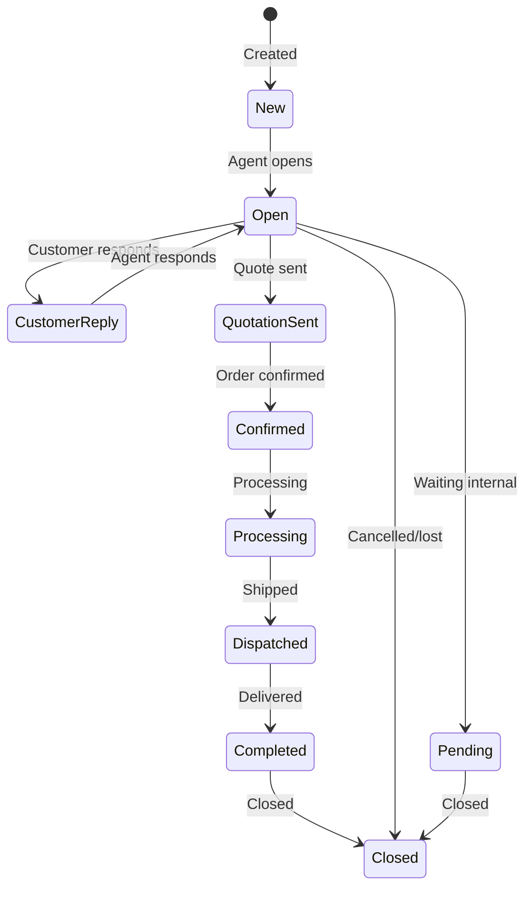

**Important:** Statuses are **configuration-driven**, not hard-coded. The diagram above reflects seed defaults. Admin can add/rename/reorder/disable statuses. State machine validates transitions via admin-configurable `allowedTransitions` on each status (optional constraint).

### 18.2 Transition Rules

| Event | System Action |
|-------|---------------|
| Status change | Log enquiryEvent, trigger automations, update SLA |
| Customer reply | Auto-set status to "Customer Reply" if configured |
| Assignment change | Log event, notify assignee |

### 18.3 Enquiry Number Generation

Format: `ENQ-{YYYY}-{SEQUENCE}`  
Atomic counter collection:

```javascript
// enquiryCounters: { year: 2026, sequence: 42 }
// Generate: ENQ-2026-0042 (zero-padded to 4+ digits)
```

---

## 19. Customer Deduplication

### 19.1 Identity Keys

| Priority | Key | Normalization |
|----------|-----|---------------|
| 1 | Phone / WhatsApp | E.164 via libphonenumber-js |
| 2 | Email | Lowercase trim |
| 3 | Business name | Fuzzy match (secondary) |

### 19.2 Normalization Pipeline

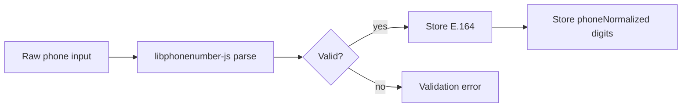

Examples resolving to same customer:

| Input | Stored |
|-------|--------|
| `9876543210` (IN) | `+919876543210` |
| `09876543210` | `+919876543210` |
| `+91 9876543210` | `+919876543210` |
| Nepal `9841234567` | `+9779841234567` |

### 19.3 Match on Enquiry Creation

```typescript
async function resolveCustomer(input: CustomerInput): Promise<Customer> {
  const phone = normalizePhone(input.phone, input.country);
  let customer = await Customer.findOne({ phoneNormalized: phone.digits });
  if (!customer && input.email) {
    customer = await Customer.findOne({ email: input.email.toLowerCase() });
  }
  if (!customer) {
    customer = await Customer.create({ ...input, phone: phone.e164 });
  }
  return customer;
}
```

### 19.4 Ambiguous Match (CRM)

When confidence < threshold, present matches to agent:

| Signal | Weight |
|--------|--------|
| Exact phone match | 100 |
| Exact email match | 80 |
| Business name similarity | 40 |
| Enquiry number in message | 90 |

Agent chooses: **Attach to existing** or **Create new**.

### 19.5 Merge

Manager permission required. Survivor retains enquiries; merged customer gets `mergedIntoId`. Audit logged.

---

## 20. WhatsApp Architecture

### 20.1 Integration Layer

```typescript
interface WhatsAppProvider {
  sendTemplate(params: SendTemplateParams): Promise<SendResult>;
  sendText(params: SendTextParams): Promise<SendResult>; // within 24h window
  markAsRead(messageId: string): Promise<void>;
  verifyWebhook(mode, token, challenge): string | null;
  parseWebhook(payload: unknown): WhatsAppEvent[];
}
```

Implementations:
- `MetaWhatsAppProvider` — production
- `MockWhatsAppProvider` — development (logs to console + DB)

### 20.2 Inbound Flow

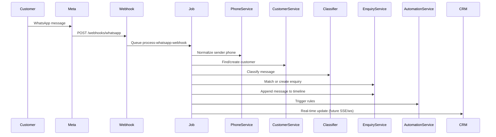

### 20.3 Outbound Flow

Agent reply in CRM → `CommunicationService.sendWhatsApp()` → template or session message → log to `communicationLogs` → append to enquiry timeline.

### 20.4 Classification (MVP — Rule-Based)

Keyword/pattern rules configurable in admin:

| Category | Example Patterns |
|----------|------------------|
| book_enquiry | "kitab", "book", "copies", quantity patterns |
| price_enquiry | "price", "rate", "mrp", "wholesale" |
| bulk_order | large quantities, "bulk" |
| catalogue_request | "catalogue", "list" |
| status_check | enquiry number pattern `ENQ-\d{4}-\d+` |
| spam | blocklist |

Architecture allows AI classifier plug-in later via same interface.

### 20.5 Enquiry Matching

Match priority:
1. Enquiry number in message text
2. Open enquiry for same customer
3. Book title mentioned + open enquiry
4. Most recent enquiry within N days

If ambiguous → flag for agent review, do not auto-merge.

---

## 21. Email Architecture

### 21.1 Provider Abstraction

```typescript
interface EmailProvider {
  send(params: { to, subject, html, text, attachments }): Promise<EmailResult>;
}
```

Providers: Resend (recommended for DX), SendGrid, SES.

### 21.2 Transactional Events

| Event Key | Trigger |
|-----------|---------|
| enquiry_created | Public enquiry submitted |
| enquiry_status_changed | Status update (if public-facing) |
| quotation_sent | Macro/automation |
| order_confirmed | Status → Confirmed |
| order_dispatched | Status → Dispatched |
| user_invite | User invited |

### 21.3 Inbound Email (Phase 7+)

Optional: parse via provider webhook → create/update enquiry similar to WhatsApp flow.

---

## 22. Communication Architecture

### 22.1 Orchestration

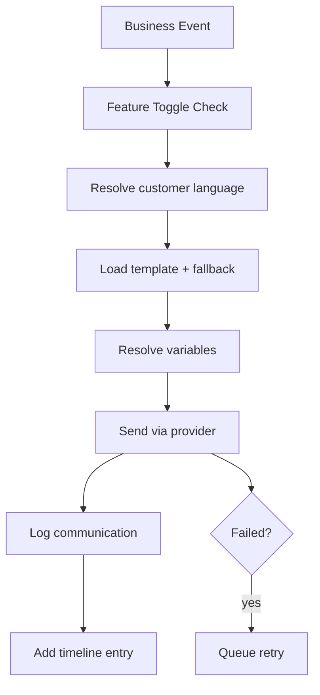

### 22.2 Template Variables

| Variable | Source |
|----------|--------|
| `{{customer_name}}` | customer.contactName |
| `{{business_name}}` | customer.businessName |
| `{{enquiry_number}}` | enquiry.enquiryNumber |
| `{{book_name}}` | requestedBooks[0].title |
| `{{quantity}}` | requestedBooks[0].quantity |
| `{{publisher_name}}` | systemSettings.publisher.name |
| `{{publisher_phone}}` | systemSettings.publisher.phone |
| `{{status}}` | status public label |
| `{{tracking_url}}` | generated link |

Variable resolver is shared between email, WhatsApp, and macros.

### 22.3 Communication Log UI

Filterable log with retry button for failed messages. Shows delivery status from provider webhooks where available.

---

## 23. Macro Architecture

### 23.1 Macro Structure

```json
{
  "name": "Quotation Sent",
  "actions": [
    { "type": "change_status", "statusId": "..." },
    { "type": "add_internal_note", "content": "Quotation sent via macro" },
    { "type": "send_email", "templateEventKey": "quotation_sent" },
    { "type": "send_whatsapp", "templateEventKey": "quotation_sent" },
    { "type": "attach_document", "mediaId": "..." },
    { "type": "create_follow_up", "dueInHours": 48 }
  ]
}
```

### 23.2 Action Types

| Action | Description |
|--------|-------------|
| change_status | Update enquiry status |
| change_priority | Update priority |
| assign_user | Set assignedUserId |
| assign_team | Set assignedTeamId |
| add_tag | Append tag |
| add_internal_note | Private note |
| send_email | Template-based email |
| send_whatsapp | Template-based WhatsApp |
| create_follow_up | Schedule follow-up |
| attach_document | Link media to enquiry |

### 23.3 Execution

Transactional: all actions execute sequentially. Failure mid-macro → log error, continue or abort based on action `critical` flag. Results shown in toast + timeline.

---

## 24. Automation Engine

### 24.1 Rule Structure

```json
{
  "name": "WhatsApp Distributor → Wholesale Team",
  "trigger": { "type": "enquiry_created" },
  "conditions": [
    { "field": "source", "operator": "equals", "value": "whatsapp" },
    { "field": "category", "operator": "equals", "value": "distributor_enquiry" }
  ],
  "actions": [
    { "type": "assign_team", "teamId": "..." }
  ],
  "isActive": true,
  "sortOrder": 10
}
```

### 24.2 Triggers

| Trigger | Fired When |
|---------|------------|
| enquiry_created | New enquiry |
| status_changed | Status transition |
| customer_replied | Inbound message |
| assignment_changed | User/team assignment |
| follow_up_due | Scheduled job |
| time_elapsed | X hours after event |

### 24.3 Condition Operators

`equals`, `not_equals`, `in`, `not_in`, `contains`, `greater_than`, `less_than`, `is_empty`, `is_not_empty`

### 24.4 Engine Flow

```typescript
async function evaluateAutomations(event: AutomationEvent) {
  const rules = await AutomationRule.find({ isActive: true }).sort('sortOrder');
  for (const rule of rules) {
    if (matchesTrigger(rule, event) && matchesConditions(rule, event)) {
      await executeActions(rule.actions, event.context);
    }
  }
}
```

Rules are **modular and admin-configurable** — no hard-coded business workflows.

---

## 25. SLA / Follow-Up Architecture

### 25.1 SLA Configuration

Stored in `systemSettings.sla` and overridable per priority:

| Metric | Default |
|--------|---------|
| First response target | 4 hours |
| Follow-up interval | 48 hours |
| Escalation time | 72 hours |
| Resolution target | 7 days |

### 25.2 SLA Tracking on Enquiry

```javascript
enquiry.sla = {
  firstResponseDue: Date,
  firstResponseAt: Date | null,
  firstResponseBreached: Boolean,
  resolutionDue: Date,
  resolutionBreached: Boolean
}
```

### 25.3 Follow-Ups

Separate `followUps` collection:

| Field | Type |
|-------|------|
| enquiryId | ObjectId |
| assignedUserId | ObjectId |
| dueAt | Date |
| note | String |
| status | pending, completed, snoozed, overdue |
| completedAt | Date |

Cron job marks overdue, triggers automations.

### 25.4 UI Indicators

- Green: on track
- Amber: due soon (< 1 hour)
- Red: breached

---

## 26. Multilingual Architecture

### 26.1 Language Configuration

Initial languages (seed):

| Code | Language | Script | Direction |
|------|----------|--------|-----------|
| en | English | Latin | ltr |
| hi | Hindi | Devanagari | ltr |
| sa | Sanskrit | Devanagari | ltr |
| ne | Nepali | Devanagari | ltr |

Hindi, Sanskrit, and Nepali are **separate languages** despite shared script.

### 26.2 Translation Storage Strategy

| Content Type | Storage |
|--------------|---------|
| UI strings | `translations` collection (key-value) |
| Books | `bookTranslations` collection |
| Categories/lookups | Embedded `translations[]` on document |
| CMS pages/sections | Embedded `translations[]` |
| Email/WhatsApp templates | Per-language template documents |
| CRM statuses | `publicLabel` translations embedded |

### 26.3 Resolution Algorithm

```typescript
function resolveTranslation(
  key: string,
  lang: string,
  fallbackLang: string
): string {
  return translations[lang]?.[key]
    ?? translations[fallbackLang]?.[key]
    ?? translations['en']?.[key]
    ?? key;
}
```

### 26.4 Frontend Routing

URL prefix strategy: `/hi/books`, `/ne/enquiry`  
Default language may omit prefix: `/books` → redirects based on Accept-Language or cookie.

Use **next-intl** with dynamic message loading from API for admin-managed strings.

### 26.5 Adding a New Language

Admin → Settings → Languages → Add Language:
1. Create `languages` record
2. Enable language
3. Admin fills translations via translation management UI
4. No code changes required

---

## 27. International Phone Architecture

### 27.1 Library

**libphonenumber-js** (lightweight, well-maintained)

### 27.2 Phone Input Component

- Country selector with flag + dial code (all countries, not India-only)
- Auto-format as user types
- Validate on blur and submit
- Store E.164 in database

### 27.3 Backend Validation

```typescript
import { parsePhoneNumberFromString } from 'libphonenumber-js';

function normalizePhone(raw: string, defaultCountry?: CountryCode) {
  const parsed = parsePhoneNumberFromString(raw, defaultCountry);
  if (!parsed?.isValid()) throw new ValidationError('INVALID_PHONE');
  return {
    e164: parsed.format('E.164'),
    digits: parsed.number.replace('+', ''),
    country: parsed.country
  };
}
```

### 27.4 Country Support

Use `i18n-iso-countries` or static ISO 3166-1 list. Customer country stored as ISO alpha-2. Phone default country derived from customer country selection.

---

## 28. Book / Catalogue Architecture

### 28.1 Data Model Summary

Books split into:
- **Core record** — physical, commercial, relations, visibility
- **Translations** — per-language content
- **Lookups** — categories, page types, binding types (admin-managed)

### 28.2 Physical Specifications

| Field | Storage | Display |
|-------|---------|---------|
| Pages | integer | "320 pages" |
| Page Type | lookup ref | "Maplitho" |
| GSM | integer | "70 GSM" |
| Weight | weightGrams | "450 g" |
| Dimensions | lengthMm × widthMm × heightMm | "216 × 140 × 25 mm" |
| Binding | lookup ref | "Paperback" |

### 28.3 Field Visibility

`book.fieldVisibility` and `book.priceVisibility` control public display independently. Hidden fields retain data.

### 28.4 Publish Workflow

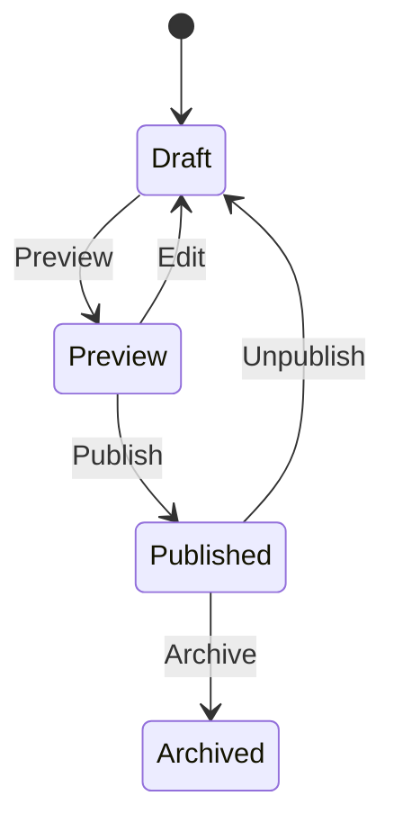

### 28.5 Public Catalogue API

- Full-text search on title, author, ISBN
- Filter by category, language, tags, availability
- Pagination
- Only `publishStatus: published` books returned
- Visibility engine applied per field

### 28.6 Category Management Architecture

Categories are **business data**, not source code. No category names, hierarchy, ordering, or visibility may be hard-coded.

#### 28.6.1 Data Model

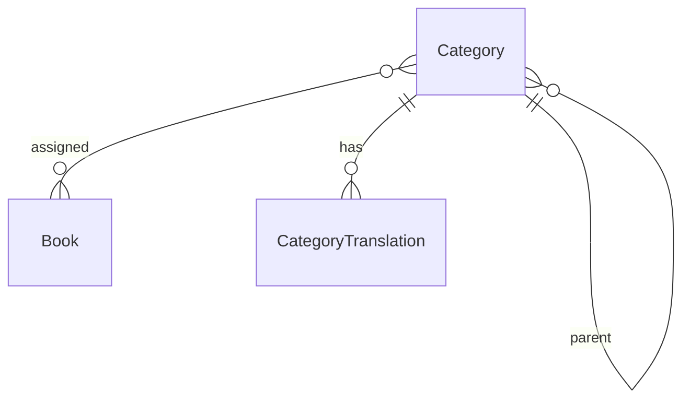

| Field | Purpose |
|-------|---------|
| `parentId` | Parent category (null = root) |
| `ancestorIds` | Denormalized path for efficient subtree queries |
| `slug` | URL-safe identifier (`/categories/bhagavad-gita`) |
| `status` | draft, published, hidden, archived |
| `isVisible` | Show/hide without deleting |
| `isFeatured` | Homepage/nav highlights |
| `displayOrder` | Sibling ordering (not alphabetical by default) |
| `imageMediaId` / `iconMediaId` | Category media |
| `translations[]` | Per-language name, shortDescription, description |
| `seo` | title, description, keywords, social, canonical, indexable |

#### 28.6.2 Hierarchy

- Unlimited depth supported (Level 1 → 2 → 3 → 4+)
- UI presents tree with expand/collapse; discourage unnecessarily deep trees
- Admin can create, move, reorder, and reparent categories
- Example hierarchy: Religious Books → Hindu Scriptures → Bhagavad Gita → Hindi Editions

#### 28.6.3 Multilingual Categories

Each category stores independent translations:

| Language | Example |
|----------|---------|
| en | Bhagavad Gita |
| hi | भगवद्गीता |
| sa | श्रीमद्भगवद्गीता |
| ne | श्रीमद्भगवद्गीता |

Missing translation → fallback language (configurable).

#### 28.6.4 Book–Category Relationship

- Books reference categories via `categoryIds: [ObjectId]` (many-to-many)
- One book may belong to multiple categories without duplication
- Category archive/delete requires safe workflow (see §28.6.8)

#### 28.6.5 Visibility & Publishing

| Control | Effect |
|---------|--------|
| `status: draft` | Admin only |
| `status: published` + `isVisible: true` | Public catalogue |
| `status: hidden` | Stored, not shown publicly |
| `status: archived` | Soft-deleted, admin recoverable |
| `isFeatured: true` | Eligible for homepage/nav highlights |

Hiding a category does **not** delete its books.

#### 28.6.6 Admin UI — Catalogue → Categories

- Visual category tree (expand/collapse)
- Create, edit, rename, reorder, move, publish/unpublish, archive
- Search by name, translation, slug, parent, status
- Confirmation for destructive actions

#### 28.6.7 Public Category Experience

- Category listing page with hierarchy
- Category detail page: `/categories/:slug`
- Filter books by category in catalogue
- Respects visibility and publish status

#### 28.6.8 Archive / Delete Safety

Before archive/delete, show book count:

> This category contains 42 books.

Admin chooses: move books to another category, remove assignments, or cancel. Never silently orphan books.

#### 28.6.9 CRM Automation Integration

Automation conditions reference **category IDs**, not hard-coded names:

```text
IF requestedBook.categoryIds CONTAINS <categoryId>
THEN assignTeam = Religious Books Team
```

#### 28.6.10 Category Permissions

| Action | Permission Key |
|--------|----------------|
| View | `categories.view` |
| Create | `categories.create` |
| Edit | `categories.edit` |
| Reorder | `categories.reorder` |
| Publish | `categories.publish` |
| Hide | `categories.hide` |
| Archive | `categories.archive` |
| Delete | `categories.delete` |

---

## 29. CMS Architecture

### 29.1 Homepage Builder

Sections stored in `sections` collection, ordered by `sortOrder`. Each section type has a JSON schema for `config`:

| Section Type | Config Example |
|--------------|----------------|
| hero | backgroundMediaId, ctaLink, overlayOpacity |
| featured_books | bookIds[], displayCount |
| categories | categoryIds[], layout: grid/list |
| whatsapp_cta | phoneNumber (or use system default) |
| custom_content | richTextMediaId |

Admin UI: drag-and-drop reorder, inline edit, draft/preview/publish per section.

### 29.2 Page Management

Each public page is a `pages` document with translations, SEO, visibility, publish status. Admin can hide/disable pages without deletion.

### 29.3 Preview Mode

Preview token or admin-authenticated preview route renders draft/unpublished content without exposing to public.

---

## 30. Visibility Engine

### 30.1 Centralized Service

```typescript
class VisibilityService {
  isFeatureEnabled(key: FeatureToggleKey): boolean;
  isPageVisible(pageSlug: string): boolean;
  isSectionVisible(sectionId: string): boolean;
  getBookFieldVisibility(book: Book, field: string): boolean;
  getPriceVisibility(book: Book, priceType: string): boolean;
  isPublicRouteEnabled(route: string): boolean;
}
```

### 30.2 Evaluation Order

1. Maintenance mode → override all public routes
2. Feature toggle (e.g., `book_catalogue: off` → hide catalogue)
3. Entity-level visibility (page.isVisible, section.isVisible)
4. Field-level visibility (book.fieldVisibility)
5. Publish status (must be published)

### 30.3 Caching

Visibility config cached in Redis with 60s TTL, invalidated on admin save.

---

## 31. Feature-Toggle Architecture

### 31.1 Toggle Keys (Seed)

| Key | Default | Effect When OFF |
|-----|---------|-----------------|
| book_catalogue | ON | Hide catalogue pages/nav |
| enquiries | ON | Disable enquiry forms |
| whatsapp | ON | Hide WhatsApp CTAs, skip WA sends |
| email | ON | Skip email sends |
| catalogue_download | OFF | Hide download button |
| pricing | OFF | Hide all pricing fields |
| public_tracking | ON | Disable track page |
| maintenance_mode | OFF | Show maintenance page |

### 31.2 Implementation

```typescript
// Middleware for public routes
async function featureGate(req, res, next) {
  const toggles = await featureToggleService.getAll();
  if (toggles.maintenance_mode) return res.maintenance();
  req.features = toggles;
  next();
}
```

Admin changes take effect immediately (cache invalidation).

---

## 32. Media Architecture

### 32.1 Storage

S3-compatible object storage. Files stored with UUID keys:

```
media/{year}/{month}/{uuid}.{ext}
```

### 32.2 Upload Flow

1. Client requests presigned URL (or multipart upload via API)
2. Client uploads directly to storage
3. Client confirms → create `media` document
4. Background job generates thumbnail for images

### 32.3 Validation

| Check | Rule |
|-------|------|
| MIME type | Allowlist: image/*, application/pdf |
| Max size | 10 MB images, 25 MB documents (configurable) |
| Filename | Sanitize, no path traversal |

### 32.4 Media Library

Central library with search, filter by type, archive, delete (soft). Usage tracking: increment on attach, show warning if in use.

---

## 33. Public Tracking Security

### 33.1 Threat Model

| Threat | Mitigation |
|--------|------------|
| Enquiry number enumeration | Verification required before data |
| Data leakage | Only public-safe statuses exposed |
| Brute force verification | Rate limiting + lockout |

### 33.2 Verification Flow

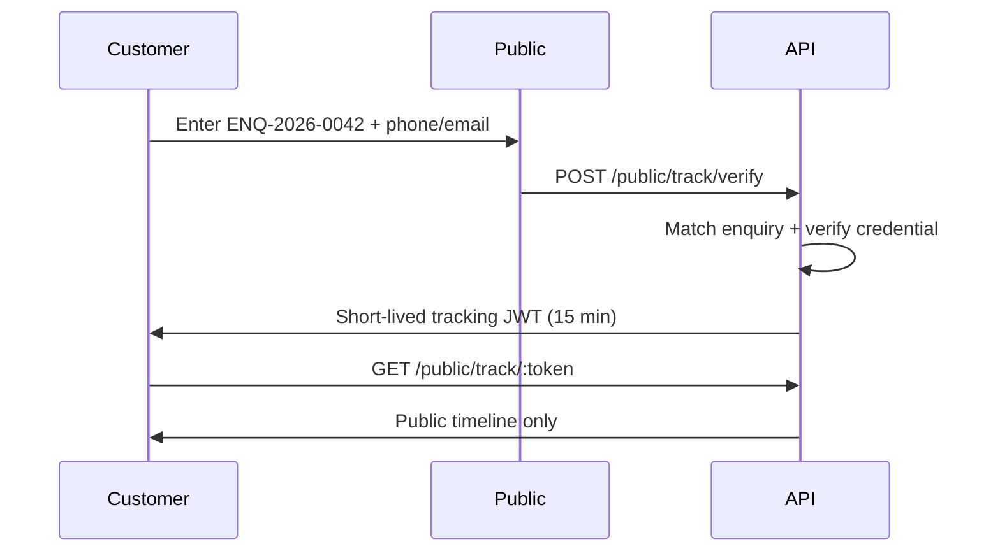

### 33.3 Verification Methods (Configurable)

| Method | MVP | Future |
|--------|-----|--------|
| Phone last 4 digits | ✓ | |
| Email match | ✓ | |
| OTP to phone/email | | ✓ |

### 33.4 Public Timeline Data

Only statuses where `status.isPublic === true`. Labels from `status.publicLabel` translations. No internal notes, agent names (unless configured), assignments, or private communications.

---

## 34. Audit Logging

### 34.1 Audited Actions

| Category | Actions |
|----------|---------|
| Users | created, updated, suspended, role_changed |
| Roles | created, updated, permissions_changed |
| Customers | created, updated, merged |
| Enquiries | status_changed, assigned, priority_changed |
| Configuration | feature_toggle, settings_changed, status_config |
| Content | page_published, book_published |
| Communication | whatsapp_config_changed |
| Security | login_failed, permission_denied |

### 34.2 Log Format

Immutable append-only. Stored in `auditLogs` with actor, target, previous/new values, timestamp, IP.

Admin → Users & Access → Audit Log: searchable, filterable, exportable.

---

## 35. Security Architecture

### 35.1 Security Controls

| Control | Implementation |
|---------|----------------|
| Authentication | JWT + httpOnly cookies |
| Authorization | RBAC middleware on every protected route |
| Password hashing | bcrypt (cost 12) |
| Input validation | Zod schemas on all inputs |
| Rate limiting | express-rate-limit / Redis-backed |
| CORS | Strict origin allowlist |
| CSRF | SameSite cookies + CSRF token for mutations |
| XSS | React auto-escape + CSP headers |
| SQL/NoSQL injection | Mongoose parameterized queries, input sanitization |
| File upload | MIME validation, size limits, virus scan (future) |
| Webhook verification | Meta signature verification |
| Secrets | Environment variables only, `.env.example` committed |
| HTTPS | Enforced in production |
| Audit | All admin actions logged |
| Permission escalation | Server-side boundary check |
| Public tracking | Verification gate |

### 35.2 Content Security Policy

```
default-src 'self';
script-src 'self';
style-src 'self' 'unsafe-inline';
img-src 'self' data: https://storage.example.com;
connect-src 'self' https://api.example.com;
```

### 35.3 Data Privacy

- Internal notes never exposed to public APIs
- Customer data scoped by RBAC
- Soft delete preserves audit trail
- PII encrypted at rest (MongoDB Atlas default)

---

## 36. Testing Strategy

### 36.1 Test Pyramid

| Layer | Tool | Focus |
|-------|------|-------|
| Unit | Vitest | Services, utils, phone normalization, variable resolver |
| Integration | Vitest + MongoDB Memory Server | API routes, RBAC, deduplication |
| E2E | Playwright | Critical user flows |

### 36.2 Required Test Scenarios (from spec §95)

| Scenario | Phase |
|----------|-------|
| Phone normalization (multi-country) | 2, 4 |
| Customer deduplication | 4 |
| One customer → multiple enquiries | 4 |
| WhatsApp enquiry matching | 7 |
| Unauthorized API → 403 | 2, 5 |
| Public tracking → no private data | 8 |
| Missing translation → fallback | 3 |
| Communication failure → logged + retry | 7 |
| Automation trigger + conditions | 6 |
| Child admin cannot escalate permissions | 5 |
| Role grant boundary enforcement | 5 |
| Feature toggle disables feature | 3 |

### 36.3 CI Pipeline

```yaml
# On PR:
- lint (ESLint + Prettier)
- typecheck (tsc)
- unit tests
- integration tests
- build
# On main:
- E2E (staging)
- deploy
```

---

## 37. Deployment Architecture

### 37.1 Environments

| Environment | Purpose |
|-------------|---------|
| local | Docker Compose: MongoDB, Redis, mock integrations |
| staging | Pre-production, real integrations optional |
| production | Live |

### 37.2 Recommended Infrastructure

| Component | Service |
|-----------|---------|
| Frontend | Vercel |
| Backend API | Railway / Fly.io / AWS ECS |
| Database | MongoDB Atlas (M10+ production) |
| Redis | Upstash / ElastiCache |
| Storage | Cloudflare R2 / AWS S3 |
| CDN | Cloudflare / Vercel Edge |
| Monitoring | Sentry + uptime monitor |
| Logs | Structured JSON → aggregation service |

### 37.3 Environment Variables

```bash
# .env.example (committed)
NODE_ENV=
MONGODB_URI=
REDIS_URL=
JWT_SECRET=
JWT_REFRESH_SECRET=
STORAGE_BUCKET=
STORAGE_ACCESS_KEY=
STORAGE_SECRET_KEY=
STORAGE_PUBLIC_URL=
EMAIL_PROVIDER=
EMAIL_API_KEY=
WHATSAPP_ACCESS_TOKEN=
WHATSAPP_PHONE_NUMBER_ID=
WHATSAPP_WEBHOOK_VERIFY_TOKEN=
WHATSAPP_APP_SECRET=
FRONTEND_URL=
BACKEND_URL=
```

### 37.4 Backups

- MongoDB Atlas automated daily backups
- Point-in-time recovery enabled
- Media storage versioning optional

---

## 38. Development Roadmap

Aligned with spec phases 2–11:

| Phase | Scope | Exit Criteria |
|-------|-------|---------------|
| **1 — Architecture** | This document | ✓ Review approved |
| **2 — Foundation** | Repo, auth, RBAC shell, UI system, public/admin shells | ✓ Complete |
| **3 — CMS + Catalogue** | Books, hierarchical categories, category translations & pages, page types, binding types, media, pages, homepage, sections, visibility, multilingual content, draft/preview/publish | Admin can manage category tree and publish book visible on public site |
| **4 — CRM** | Customers, enquiries, timeline, search, deduplication | Enquiry created, customer matched, timeline works |
| **5 — User Management** | Users, teams, roles, scopes, audit | Child admin cannot escalate, audit logs work |
| **6 — CRM Productivity** | Macros, automations, SLA, follow-ups | Macro executes, automation triggers on event |
| **7 — Communication** | Email, WhatsApp, templates, logs | Enquiry confirmation sent both channels |
| **8 — Public Tracking** | Verify + timeline | No private data leaked |
| **9 — Analytics** | Dashboard, reports, export | Basic reports generate |
| **10 — Security + QA** | Full test suite, penetration review | All §95 scenarios pass |
| **11 — Production** | Deploy, domain, monitoring | Live on production URL |

**Estimated timeline (single developer):** 16–24 weeks incremental.

---

## 39. Open Questions & Decisions Required

The following items require stakeholder approval before Phase 2:

| # | Question | Recommendation | Impact |
|---|----------|----------------|--------|
| 1 | **Backend framework:** Express vs Fastify? | Fastify — faster, schema validation built-in | Low |
| 2 | **Real-time CRM updates:** SSE, WebSocket, or polling? | SSE for MVP (simpler), WebSocket later | Medium |
| 3 | **Public tracking verification:** Phone last-4 sufficient for MVP? | Yes for MVP; OTP in Phase 8+ | Low |
| 4 | **Hosting preference:** Vercel + Railway acceptable? | Yes unless existing infra | Medium |
| 5 | **Email provider:** Resend vs SendGrid? | Resend for DX; switchable via adapter | Low |
| 6 | **Object storage:** Cloudflare R2 vs AWS S3? | R2 — no egress fees | Low |
| 7 | **Single Next.js app vs separate admin app?** | Single app, route groups — simpler deploy | Medium |
| 8 | **Book slug uniqueness:** Global or per-language? | Per-language (bookTranslations.slug) | Low |
| 9 | **Inbound email parsing in MVP?** | Defer to post-MVP unless required | Medium |
| 10 | **CAPTCHA on public enquiry form?** | hCaptcha/Turnstile, configurable toggle | Low |
| 11 | **Super Admin count:** Single super admin or multiple? | Multiple allowed, role flagged | Low |
| 12 | **Currency:** Single currency (INR) or multi? | Store currency per book, default INR | Low |

---

## Appendix A: Permission Seed Data

Complete permission keys to seed on first deploy:

```
books.view, books.create, books.edit, books.archive, books.delete, books.publish, books.change_visibility
categories.view, categories.create, categories.edit, categories.reorder, categories.publish, categories.hide, categories.archive, categories.delete
media.view, media.upload, media.edit, media.archive, media.delete
customers.view, customers.create, customers.edit, customers.merge, customers.archive, customers.delete
enquiries.view, enquiries.create, enquiries.edit, enquiries.assign, enquiries.reassign, enquiries.reply, enquiries.internal_note, enquiries.change_status, enquiries.change_priority, enquiries.close, enquiries.reopen, enquiries.delete
communication.view, communication.send_email, communication.send_whatsapp, communication.retry, communication.manage_templates
macros.view, macros.create, macros.edit, macros.delete, macros.execute
automations.view, automations.create, automations.edit, automations.enable_disable, automations.delete
website.view, website.edit, website.publish, website.unpublish
users.view, users.create, users.edit, users.disable, users.delete
roles.view, roles.create, roles.edit, roles.delete, roles.assign_permissions
reports.view, reports.export
settings.view, settings.edit
```

## Appendix B: Feature Toggle Seed Data

See §31.1.

## Appendix C: Status Seed Data

See §18.1 — 10 default statuses with `isPublic` flags configured for tracking timeline.

## Appendix D: Language Seed Data

See §26.1 — en (default), hi, sa, ne with en as fallback.

---

**End of Phase 1 Architecture Document**

*Awaiting review and approval before proceeding to Phase 2.*
